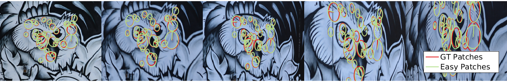
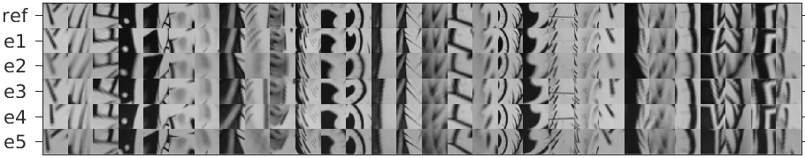
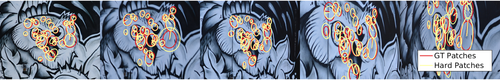
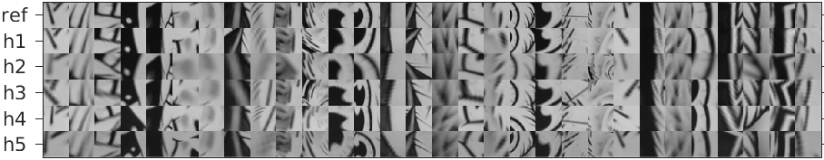

# HPatches: Homography-patches dataset

This repository contains details about the `HPatches` (Homography
patches) dataset. 

More details can be found on the relevant `CVPR 2017` publication
[[1]](#refs).

The `HPatches` dataset was used as the basis for the local descriptor
evaluation challenge that was presented in the
[Local Features: State of the Art, Open Problems and Performance Evaluation](http://icvl.ee.ic.ac.uk/DescrWorkshop/index.html)
workshop during ECCV 2016.

There is a companion
[benchmarking](https://github.com/hpatches/hpatches-benchmark) toolbox
which defines the tasks and implements the `HPatches` evaluation
protocol. Note that the benchmarking code allows to automatically
download all the needed dataset files with a use of an automated
script, and thus is the suggested way to use the dataset for
descriptor evaluation purposes.

If there is a need to manually get the `HPatches` dataset, download
and untar the following file:

* [HPatches](http://icvl.ee.ic.ac.uk/vbalnt/hpatches/hpatches-release.tar.gz) [4.2GB].

Sample code for reading the patches in `python` and `matlab` is
provided in the
[hpatches-benchmark](https://github.com/hpatches/hpatches-benchmark)
repository.

## Dataset Description

Patches are extracted from a number of image sequences, where each
sequence contains images of the same scenes. Sequences are organised
in folders depending on the type of transformations between images:

* `i_X`: patches extracted from image sequences with illumination changes.
* `v_X`: patches extracted from image sequences with viewpoint changes.

For each image sequence, we provide a set of reference patches
`ref.png` extracted from an image used as reference. For all other
images in the sequence, we provide two more files, `eX.png` and
`hX.png`, containing the "same" (corresponding) patches as found in
the other images. In order to simulate the limitations of common patch
detectors, correspondence are extracted by adding a certain amount of
geometric noise (affine jitter). In particular, the `e` (easy) patches
have little geometric noise and the `h` (hard) patches have more. Each
patch has a size of `65x65` pixels and a single `*.png` file contains
all the patches extracted from an image stacked along a single column.

## Patch Extraction Method

Each image sequence contains a reference image and 5 target images
taken under a different illumination and/or, for a planar scenes, a
different viewpoint. For all images we have the estimated ground truth
homography $H$ with respect to the reference (stored in CSV files
`H_ref_X` where $X=1,...,5$).


*Image 1: Example image sequence. The leftmost image is the reference image, followed by 5 images with a different viewpoint.*

Patches are sampled in the reference image using a combination of
local feature extractors (Hessian, Harris and DoG detector). The patch
orientation is estimated using a single major orientation using Lowe's
method. No affine adaptation is used, therefore all patches are square
regions in the reference image.

Patches are extracted from regions with a scale magnified by a factor
of 5 compared to the original detected feature scale. Only patches for
which this region is fully contained in the image are kept.

In order to prevent multiple detections at the same location, multiple
detections with ellipse overlap greater than 50% are clustered and a
single ellipse at random is kept. A subset of the detected patches
with their measurement regions is shown in the following image:


*Image 2: Example detections in the reference image. Patches locations are visualized as ellipses. The scale of the detected patches (orange) is magnified by factor 5 to obtain the patch measurement region (yellow).*

In order to extract the patches from a target image, first an affine
jitter is applied. The goal of the affine jitter is to simulate the
geometric repeatability error of typical local features detector.

For easy jitter, the median ellipse overlap with the original patches
is ~0.85 and for hard jitter it is ~0.72. After jittering, the frames
are reprojected to the target image using the ground truth homography.

The following images show the reprojected easy/hard patches in the
target image together with the extracted patches.



*Image 3: Visualization of the easy patches locations in the target images.*



*Image 4: Extracted easy patches from the example sequence.*



*Image 5: Visualization of the hard patches locations in the target images.*



*Image 6: Extracted hard patches from the example sequence.*


## Full image sequences

In addition to the extracted patch-based dataset, we provide the full
image sequences that were used, together with the corresponding
homographies.

* [HPatches full sequences](http://icvl.ee.ic.ac.uk/vbalnt/hpatches/hpatches-sequences-release.tar.gz) [1.3GB].

For information about relevant citations concerning patches extracted
from sequences that were not originally introduced in this dataset,
please check [references.txt](references.txt).

Please cite the original sources if you use `HPatches` for your
research.

### References
<a name="refs"></a>

[1] *HPatches: A benchmark and evaluation of handcrafted and learned local descriptors*, Vassileios Balntas*, Karel Lenc*, Andrea Vedaldi and Krystian Mikolajczyk, CVPR 2017. [arXiv pdf] (https://arxiv.org/pdf/1704.05939.pdf)
*Authors contributed equally.

```
@InProceedings{hpatches_2017_cvpr,
author={Vassileios Balntas and Karel Lenc and Andrea Vedaldi and Krystian Mikolajczyk},
title = {HPatches: A benchmark and evaluation of handcrafted and learned local descriptors},
booktitle = {CVPR},
year = {2017}}
```
